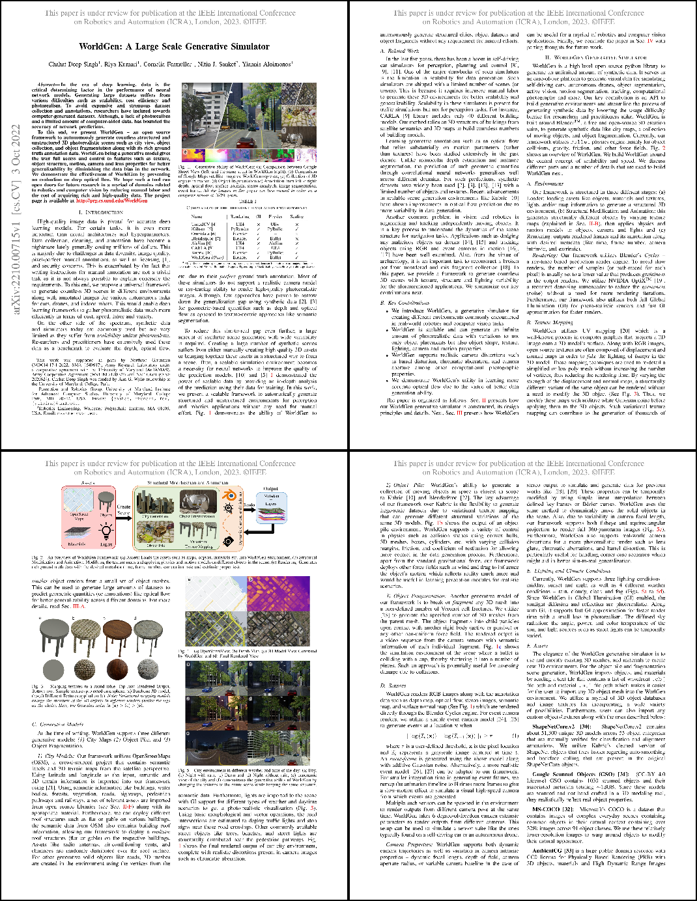

About WorldGen
====

.. image:: ../images/paper/Banner.png
  :width: 75%
  :alt: WorldGen Banner Image

Generative ability of WorldGen (shown in the figure above): (a) Comparison between Google Street View (left) and the same street in WorldGen (right), (b) Comparison of Google Maps satellite image vs. WorldGen top view, (c) Collection of 3D objects in motion, (d) Object fragmentation,(e) Annotation from left to right: depth, optical flow, surface normals, stereo anaglyph, image segmentation, event frame.

----

Abstract
----

In the era of deep learning, data is the critical determining factor in the performance of neural network models. Generating large datasets suffers from various difficulties such as scalability, cost efficiency and photorealism. To avoid expensive and strenuous dataset collection and annotations, researchers have inclined towards computer-generated datasets. Although, a lack of photorealism and a limited amount of computer-aided data, has bounded the accuracy of network predictions.

To this end, we present WorldGen - an open source framework to autonomously generate countless structured and unstructured 3D photorealistic scenes such as city view, object collection, and object fragmentation along with its rich ground truth annotation data. WorldGen being a generative model gives the user full access and control to features such as texture, object structure, motion, camera and lens properties for better generalizability by diminishing the data bias in the network. We demonstrate the effectiveness of WorldGen by presenting an evaluation on deep optical flow. We hope such a tool can open doors for future research in a myriad of domains related to robotics and computer vision by reducing manual labor and the cost of acquiring rich and high-quality data.

----

Citation
----

- Singh, C.D., Kumari, R., Fermüller, C., Sanket, N.J. and Aloimonos, Y., 
WorldGen: A Large Scale Generative Simulator. 
2023 IEEE International Conference on Robotics and Automation (ICRA)

.. code-block:: latex
@article{singh2022worldgen,
  title={WorldGen: A Large Scale Generative Simulator},
  author={Singh, Chahat Deep and Kumari, Riya and Ferm{\"u}ller, Cornelia and Sanket, Nitin J and Aloimonos, Yiannis},
  journal={arXiv preprint arXiv:2210.00715},
  year={2022}
}
