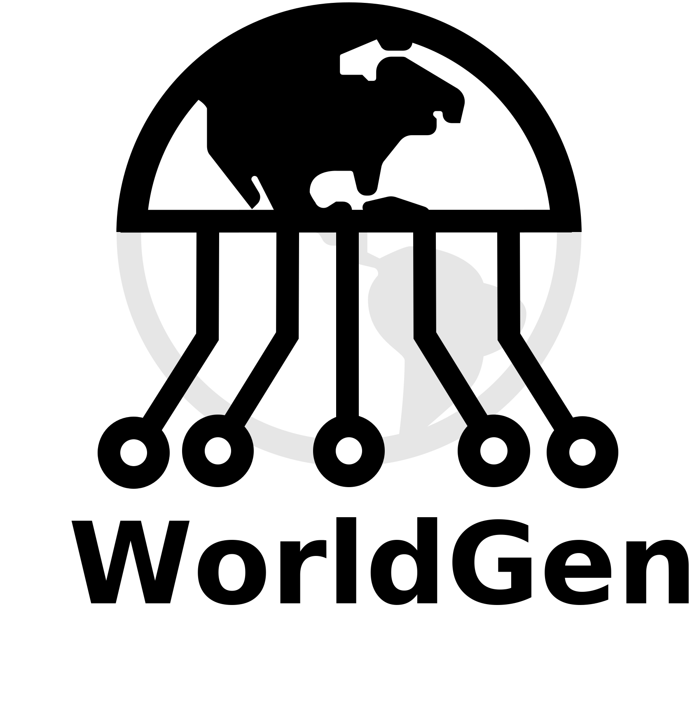

Welcome to WorldGen's documentation!
===================================

**WorldGen** is an open source framework to automatically generate petabytes of annotated structured and unstructured 3D photorealistic scenes -- including city maps, multiple objects in motion and object fragmentation.

.. image:: ../images/logo/umd-logo.png
  :width: 10%
  :alt: University of Maryland - College Park

.. image:: ../images/logo/WPIlogo.jpg
  :width: 10%
  :alt: Worcester Polytechnic Institute

----

.. note::

   This project is under active development.

----

Authors:
----

* `Chahat Deep Singh <https://chahatdeep.github.io/>`_ (Maintainer)
* `Riya Kumari <http://prg.cs.umd.edu/WorldGen>`_ (Maintainer)
* `Cornelia Fermüller <http://users.umiacs.umd.edu/~fer/>`_
* `Nitin J. Sanket <https://nitinjsanket.github.io/>`_
* `Yiannis Aloimonos <https://prg.cs.umd.edu/>`_

----

.. raw:: html

    

        <iframe src="//www.youtube.com/embed/IOz8-KL900A" frameborder="0" allowfullscreen style="position: absolute; top: 0; left: 0; width: 100%; height: 100%;"></iframe>
    

=====

Table of Content
----

.. toctree::
   :maxdepth: 0
   
   Home <https://worldgen.readthedocs.io/>

.. toctree::
   :maxdepth: 1
   :caption: Getting Started

   About WorldGen <About>
   Why WorldGen?
   LICENSE <LICENSE>
   

.. toctree::
   :maxdepth: 1
   :caption: WorldGen Setup
   
   Installation Guide <Installation>
   Understanding the Environment <Simulator>
   
   
.. toctree::
   :maxdepth: 1
   :caption: City Maps

   Create your First Digital Twin of a City <CityScenes>
   City Config Files <City Config>
   Assets <Assets>
   WorldGen on Custom Data (Coming Soon) <> 
   
.. toctree::
   :maxdepth: 1
   :caption: Object Pile
 
   ObjectPile <ObjectPile>
   
.. toctree::
   :maxdepth: 1
   :caption: Object Fragmentation
 
   ObjectFragment <ObjectFragment>
   
.. toctree::
   :maxdepth: 1
   :caption: Rendering 
    
   Annotations <Annotations>
   CameraSettings <CameraSettings>
   RenderSettings <RenderSettings>
   Physics <Physics>
   
.. toctree::
   :maxdepth: 1
   :caption: Extras
   
   Other Assets <other-assets>
   Metadata <Metadata>
