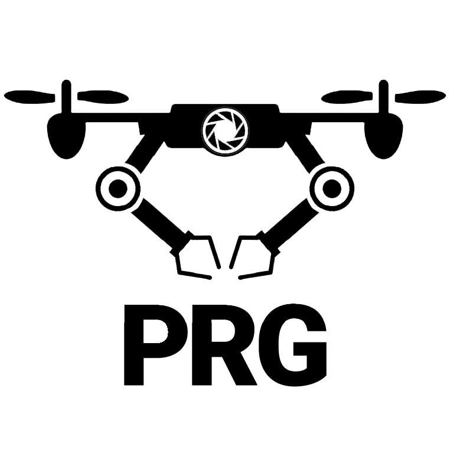

Welcome to WorldGen's documentation!
===================================

.. image:: ../images/logo/umd-logo.png
  :width: 25%
  :alt: University of Maryland - College Park

.. image:: ../images/logo/WPIlogo.jpg
  :width: 25%
  :alt: Worcester Polytechnic Institute

**WorldGen** is an open source framework to automatically generate petabytes of annotated structured and unstructured 3D photorealistic scenes -- including city maps, multiple objects in motion and object fragmentation.

----

.. note::

   This project is under active development.

----
Authors:

* `Chahat Deep Singh <https://chahatdeep.github.io/>`_ (Maintainer)
* `Riya Kumari <http://prg.cs.umd.edu/WorldGen>`_ (Maintainer)
* `Cornelia Fermüller <http://users.umiacs.umd.edu/~fer/>`_
* `Nitin J. Sanket <https://nitinjsanket.github.io/>`_
* `Yiannis Aloimonos <https://prg.cs.umd.edu/>`_

----

.. raw:: html

    

        <iframe src="//www.youtube.com/embed/IOz8-KL900A" frameborder="0" allowfullscreen style="position: absolute; top: 0; left: 0; width: 100%; height: 100%;"></iframe>
    

=====

.. toctree::
   :maxdepth: 2
   :caption: Contents:
   
   GettingStarted
   About
   Installation
   Simulator
   Assets
   Metadata
   CityScenes
   ObjectPile
   ObjectDefragment
   RenderSettings
   CameraSettings
   Annotations
   Physics
   
   
   
   
